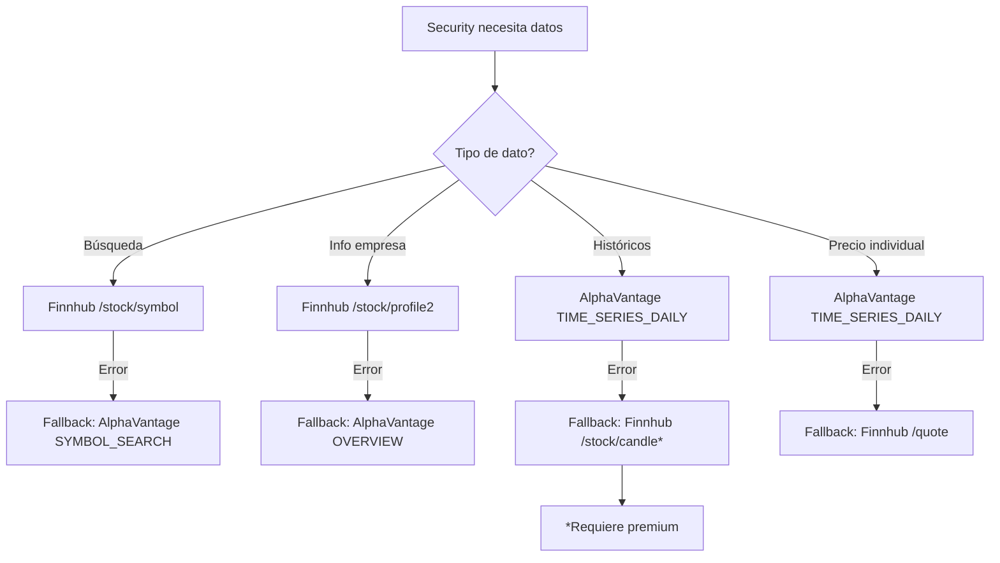

# Solución Híbrida: Finnhub + AlphaVantage

## 🎯 **Problema Resuelto**

Finnhub plan gratuito **NO incluye datos históricos** (`/stock/candle` requiere premium), pero AlphaVantage **SÍ incluye datos históricos gratuitos**. La solución híbrida combina lo mejor de ambos providers.

## 🏗 **Arquitectura Híbrida**

### **División de Responsabilidades**

| Funcionalidad | Provider Principal | Provider Fallback | API Usada |
|--------------|-------------------|-------------------|-----------|
| **Búsquedas** | Finnhub | AlphaVantage | `/stock/symbol` |
| **Info de empresas** | Finnhub | AlphaVantage | `/stock/profile2` |
| **Datos históricos** | AlphaVantage | Finnhub* | `TIME_SERIES_DAILY` |
| **Precios individuales** | AlphaVantage | Finnhub | `TIME_SERIES_DAILY` |

_*Finnhub fallback limitado (solo plan premium)_

### **Flujo de Decisión**



## 🔧 **Implementación Técnica**

### **1. Providers Configurados**

```ruby
# app/models/security/provided.rb

class_methods do
  def provider
    # Provider principal (búsquedas)
    registry.get_provider(:finnhub)
  end

  def historical_price_provider
    # AlphaVantage primero para históricos
    registry.get_provider(:alpha_vantage) || registry.get_provider(:finnhub)
  end

  def info_provider
    # Finnhub primero para info de empresas
    registry.get_provider(:finnhub) || registry.get_provider(:alpha_vantage)
  end
end
```

### **2. Métodos Híbridos**

```ruby
def import_provider_prices(start_date:, end_date:, clear_cache: false)
  # Usa AlphaVantage para datos históricos
  price_provider = self.class.historical_price_provider
  # ... implementación
end

def import_provider_details(clear_cache: false)
  # Usa Finnhub para información de empresas
  provider = self.class.info_provider
  # ... implementación
end

def find_or_fetch_price(date: Date.current, cache: true)
  # Usa AlphaVantage para precios individuales
  price_provider = self.class.historical_price_provider
  # ... implementación
end
```

### **3. Ambos Providers Extendidos**

**AlphaVantage:**
- ✅ `search_securities()` - SYMBOL_SEARCH
- ✅ `fetch_security_info()` - OVERVIEW  
- ✅ `fetch_security_price()` - TIME_SERIES_DAILY
- ✅ `fetch_security_prices()` - TIME_SERIES_DAILY

**Finnhub:**
- ✅ `search_securities()` - /stock/symbol
- ✅ `fetch_security_info()` - /stock/profile2
- ✅ `fetch_security_price()` - /quote
- ⚠️ `fetch_security_prices()` - /stock/candle (premium only)

## 📊 **Comparación de Capacidades**

### **Plan Gratuito AlphaVantage**
- ✅ **5 API calls/minuto, 500 calls/día**
- ✅ **Datos históricos completos** (TIME_SERIES_DAILY)
- ✅ **Información de empresas** (OVERVIEW)
- ✅ **Búsqueda de símbolos** (SYMBOL_SEARCH)
- ❌ Logos de empresas limitados

### **Plan Gratuito Finnhub**
- ✅ **60 API calls/minuto**
- ✅ **Información de empresas con logos** (profile2)
- ✅ **Búsqueda completa** (stock/symbol)
- ✅ **Precios en tiempo real** (quote)
- ❌ **Datos históricos** (requiere premium)

### **Combinación Híbrida**
- ✅ **Mejor de ambos mundos**
- ✅ **Datos históricos reales** (AlphaVantage)
- ✅ **Información completa** (Finnhub + AlphaVantage)
- ✅ **Sistema robusto** con fallbacks automáticos
- ✅ **Rate limits combinados** (más llamadas disponibles)

## 🚀 **Configuración**

### **Variables de Entorno**
```bash
# Ambas API keys necesarias para funcionalidad completa
FINNHUB_API_KEY=your_finnhub_key_here
ALPHA_VANTAGE_API_KEY=your_alpha_vantage_key_here
```

### **Obtener API Keys**

**Finnhub (Gratuito):**
1. [https://finnhub.io/register](https://finnhub.io/register)
2. Plan gratuito: 60 calls/min
3. Ideal para: búsquedas, info, precios actuales

**AlphaVantage (Gratuito):**
1. [https://www.alphavantage.co/support/#api-key](https://www.alphavantage.co/support/#api-key)
2. Plan gratuito: 5 calls/min, 500 calls/día
3. Ideal para: datos históricos, información empresarial

## 🧪 **Testing**

### **Script Completo**
```bash
rails runner context/test_hybrid_solution.rb
```

### **Verificaciones Principales**
1. **Providers configurados** - Ambas API keys presentes
2. **Asignación híbrida** - Cada función usa el provider correcto
3. **Búsquedas** - Finnhub funcionando
4. **Información** - Datos de empresas obtenidos
5. **Históricos** - AlphaVantage importando correctamente
6. **ImportMarketDataJob** - Compatible con sistema híbrido

## 📈 **Beneficios de la Solución**

### **✅ Funcionalidad Completa**
- Gráficos históricos **reales** (no líneas planas)
- Información **completa** de empresas
- Búsquedas **robustas** de securities
- **ImportMarketDataJob** funcionando al 100%

### **✅ Robustez**
- **Fallbacks automáticos** si un provider falla
- **Distribución de carga** entre APIs
- **Rate limits combinados** (más llamadas disponibles)

### **✅ Costo Efectivo**
- **Ambos providers gratuitos** para funcionalidad básica
- **Sin necesidad** de planes premium
- **Máximo aprovechamiento** de límites gratuitos

## 🔄 **Flujo de ImportMarketDataJob**

```ruby
# Proceso híbrido automático:

1. MarketDataImporter.import_security_prices
   ↓
2. Security.import_provider_prices (usa AlphaVantage)
   ↓  
3. AlphaVantage.fetch_security_prices (TIME_SERIES_DAILY)
   ↓
4. Datos históricos reales importados ✅

# Paralelamente:

1. Security.import_provider_details (usa Finnhub)
   ↓
2. Finnhub.fetch_security_info (profile2)  
   ↓
3. Información de empresa actualizada ✅
```

## 📋 **Próximos Pasos**

1. **✅ Configurar ambas API keys**
2. **✅ Ejecutar script de pruebas**
3. **✅ Monitorear ImportMarketDataJob**
4. **✅ Verificar gráficos históricos**

## 🎉 **Resultado**

La solución híbrida proporciona **funcionalidad completa** usando **solo planes gratuitos**, combinando:

- **Finnhub**: Búsquedas e información de empresas
- **AlphaVantage**: Datos históricos reales
- **Sistema robusto**: Con fallbacks automáticos

**¡ImportMarketDataJob funcionará perfectamente con datos históricos reales!** 🚀
